## LFX Mentorship Pre-test for #3168 & #3170
- [LFX Mentorship Pre-test for #3168 \& #3170](#lfx-mentorship-pre-test-for-3168--3170)
  - [00 Enveriment](#00-enveriment)
  - [01 Framework Execution](#01-framework-execution)
    - [1.1 mlx](#11-mlx)
      - [1.1.1 Installation](#111-installation)
      - [1.1.2 mlx whisper example](#112-mlx-whisper-example)
    - [1.2 whisper.cpp](#12-whispercpp)
  - [02 Using wasmedge](#02-using-wasmedge)
    - [2.1 build the `llama.cpp` plugin](#21-build-the-llamacpp-plugin)
      - [Install hydai/0.13.5\_ggml\_lts](#install-hydai0135_ggml_lts)
    - [2.2 run a specific model](#22-run-a-specific-model)
      - [Download the model](#download-the-model)
      - [API Test](#api-test)
      - [Chat with the model via a web UI](#chat-with-the-model-via-a-web-ui)


### 00 Enveriment

- MacBook Air m1 8+256
- macOS Sonoma 14.2.1
- Terminal : iTerm
- Python 3.10.9
- GNU Make 3.81
- cmake version 3.28.0
- Homebrew 4.1.14

### 01 Framework Execution

Applicants must demonstrate proficiency in building and executing backend frameworks. You are required to share screenshots and a brief documentation detailing your build and execution process for examples from these frameworks. You can pick any example to demonstrate the execution.

#### 1.1 [mlx](https://github.com/ml-explore/mlx)

##### 1.1.1 Installation

follow the guide [**here**](https://ml-explore.github.io/mlx/build/html/index.html).

- Python Installation

```bash
pip install mlx
```

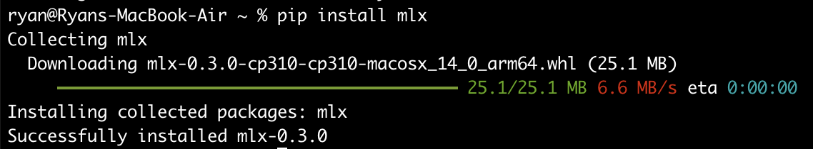

**Build in C++** 

MLX must be built and installed from source

```
git clone git@github.com:ml-explore/mlx.git mlx && cd mlx
```

```
mkdir -p build && cd build
cmake .. && make -j
```

```
make test
make install
```

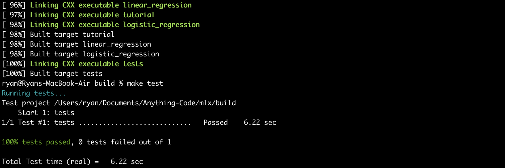

##### 1.1.2 mlx whisper [example](https://github.com/ml-explore/mlx-examples/tree/main/whisper)

Get the working directory

```bash
git clone https://github.com/ml-explore/mlx-examples.git
cd mlx-examples/whisper
```

Set up

```
pip install -r requirements.txt
brew install ffmpeg
```

Convert the model to MLX format

```
python convert.py --torch-name-or-path tiny --mlx-path mlx_models/tiny
```

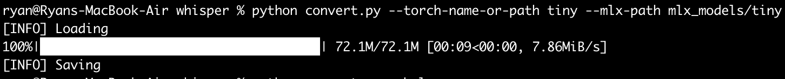

Convert audio to text

```python
import whisper
output = whisper.transcribe("/Users/ryan/Downloads/audio.mp3", word_timestamps=True)
print(output["segments"][0]["words"])
```

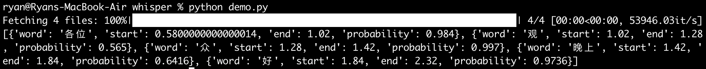

```python
import whisper
output = whisper.transcribe("/Users/ryan/Downloads/audio.mp3", word_timestamps=True)
print(output["segments"][0]["words"])
```

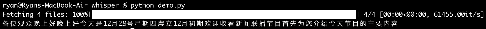

#### 1.2 [whisper.cpp](https://github.com/ggerganov/whisper.cpp)

clone the repo

```
git clone https://github.com/ggerganov/whisper.cpp.git
```

download and convert to ggml

```
bash ./models/download-ggml-model.sh base.en
```

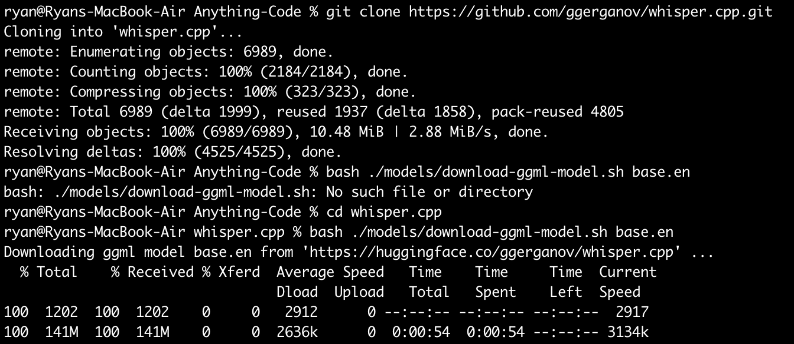

built and test

```
make

./main -f samples/jfk.wav
```

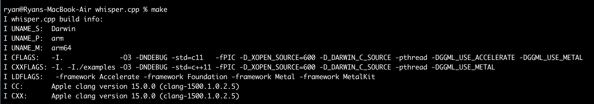

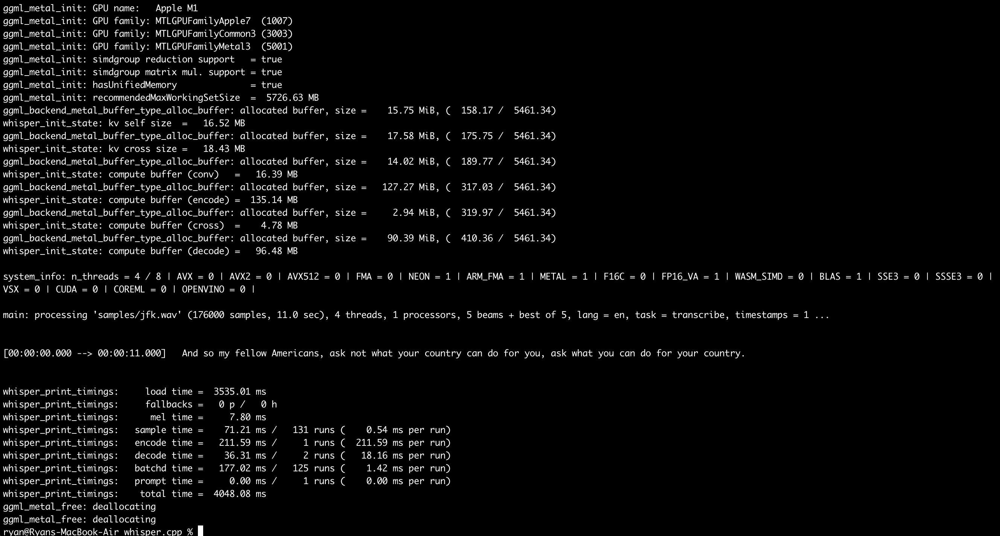

### 02 Using wasmedge

using hydai/0.13.5_ggml_lts branch

#### 2.1 build the `llama.cpp` plugin

Follow [this guide](https://wasmedge.org/docs/contribute/source/plugin/wasi_nn/#build-wasmedge-with-wasi-nn-llamacpp-backend) to build the `llama.cpp` plugin and execute it with [this chat example](https://github.com/second-state/WasmEdge-WASINN-examples/tree/master/wasmedge-ggml-llama-interactive) or [this API server example](https://github.com/second-state/LlamaEdge/tree/main/api-server).

##### Install hydai/0.13.5_ggml_lts

```
git clone https://github.com/WasmEdge/WasmEdge.git -b hydai/0.13.5_ggml_lts
```

```
cd WasmEdge
```

```
brew install grpc
brew install llvm
brew install cmake
export LLVM_DIR=/opt/homebrew/opt/llvm/lib/cmake
```

```
#for Apple Silicon Model
cmake -GNinja -Bbuild -DCMAKE_BUILD_TYPE=Release \
  -DWASMEDGE_PLUGIN_WASI_NN_BACKEND="GGML" \
  -DWASMEDGE_PLUGIN_WASI_NN_GGML_LLAMA_METAL=ON \
  -DWASMEDGE_PLUGIN_WASI_NN_GGML_LLAMA_BLAS=OFF \
  .
```

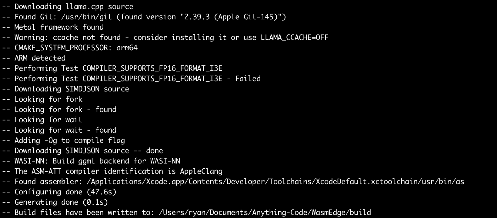

```
cmake --build build
```

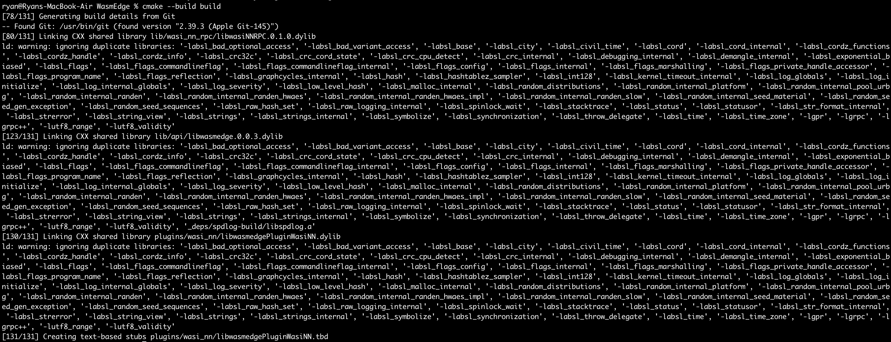

```
cmake --install build
```

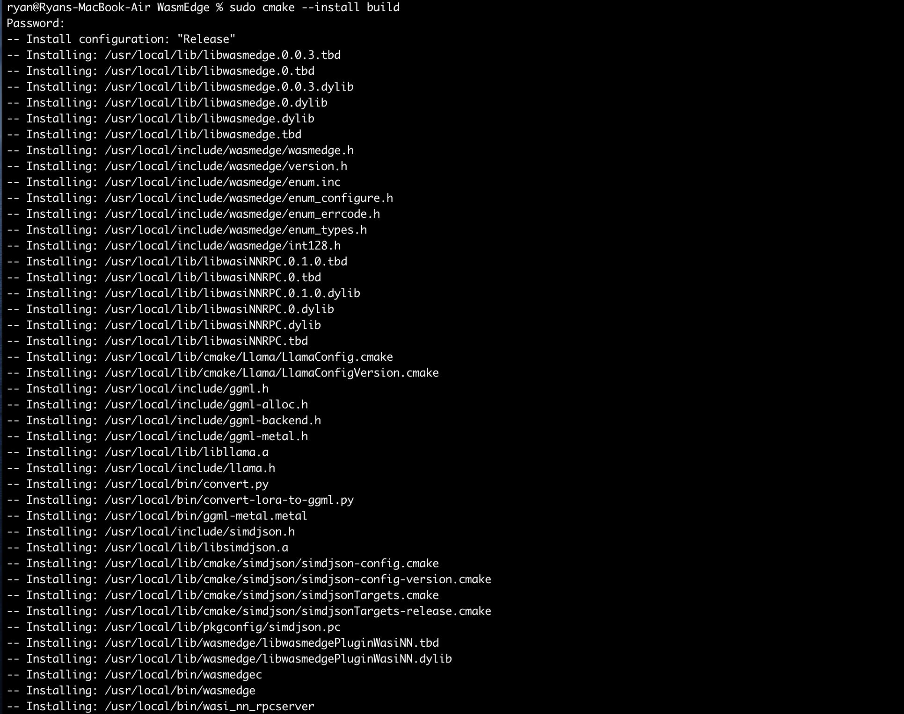

#### 2.2 run a specific model

##### Download the model

```
curl -LO https://huggingface.co/second-state/Llama-2-7B-Chat-GGUF/resolve/main/Llama-2-7b-chat-hf-Q5_K_M.gguf
```

Chat with the model on the CLI

```
curl -LO https://github.com/second-state/LlamaEdge/releases/latest/download/llama-chat.wasm

wasmedge --dir .:. --nn-preload default:GGML:AUTO:Llama-2-7b-chat-hf-Q5_K_M.gguf llama-chat.wasm -p llama-2-chat
```

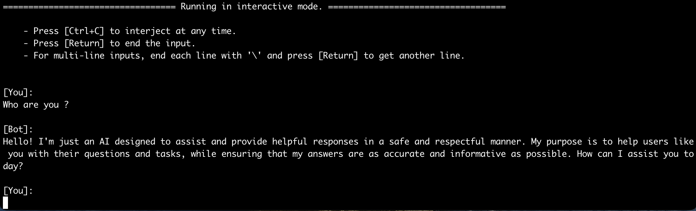

##### API Test

```
curl -LO https://github.com/second-state/LlamaEdge/releases/latest/download/llama-api-server.wasm
curl -LO https://github.com/second-state/chatbot-ui/releases/latest/download/chatbot-ui.tar.gz
tar xzf chatbot-ui.tar.gz
rm chatbot-ui.tar.gz

wasmedge --dir .:. --nn-preload default:GGML:AUTO:Llama-2-7b-chat-hf-Q5_K_M.gguf llama-api-server.wasm -p llama-2-chat
```

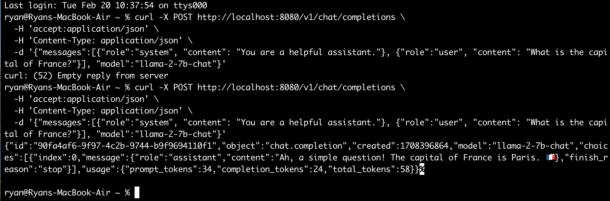

##### Chat with the model via a web UI

```
curl -LO https://github.com/second-state/chatbot-ui/releases/latest/download/chatbot-ui.tar.gz
tar xzf chatbot-ui.tar.gz
```

```
wasmedge --dir .:. --nn-preload default:GGML:AUTO:llama-2-7b-chat-hf-Q5_K_M.gguf llama-api-server.wasm -p llama-2-chat
```

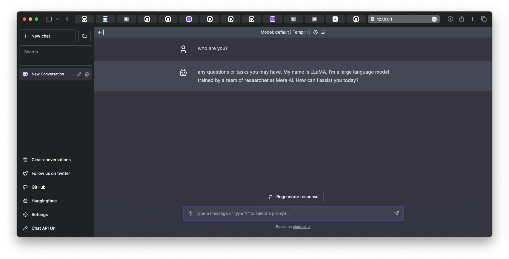

